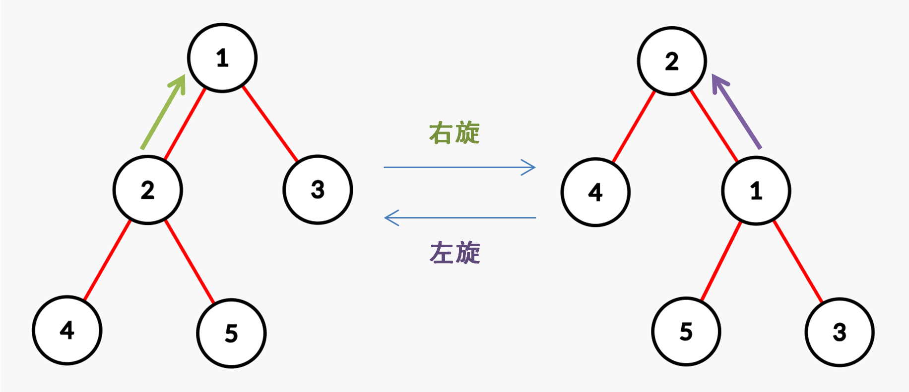
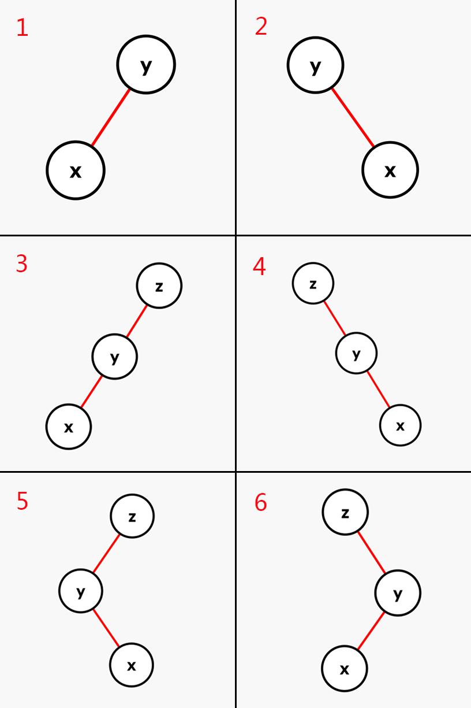

> 如何用 $\text{Splay}$ 维护二叉查找树。

* * *

## 简介

 $\text{Splay}$ 是一种二叉查找树，它通过不断将某个节点旋转到根节点，使得整棵树仍然满足二叉查找树的性质，并且保持平衡而不至于退化为链，它由 Daniel Sleator 和 Robert Tarjan 发明。

* * *

## 结构

### 二叉查找树的性质

首先肯定是一棵二叉树！

能够在这棵树上查找某个值的性质：左子树任意节点的值 $<$ 根节点的值 $<$ 右子树任意节点的值。

### 节点维护信息

|  $rt$  |  $tot$  |  $fa[i]$  |  $ch[i][0/1]$  |  $val[i]$  |  $cnt[i]$  |  $sz[i]$  |
| :----- | :------ | :-------- | :------------- | :--------- | :--------- | :-------- |
| 根节点编号  | 节点个数    | 父亲        | 左右儿子编号         | 节点权值       | 权值出现次数     | 子树大小      |

* * *

## 操作

### 基本操作

-    $\text{maintain}(x)$ ：在改变节点位置后，将节点 $x$ 的 $\text{size}$ 更新。
-    $\text{get}(x)$ ：判断节点 $x$ 是父亲节点的左儿子还是右儿子。
-    $\text{clear}(x)$ ：销毁节点 $x$ 。

```cpp
void maintain(int x) { sz[x] = sz[ch[x][0]] + sz[ch[x][1]] + cnt[x]; }
bool get(int x) { return x == ch[fa[x]][1]; }
void clear(int x) { ch[x][0] = ch[x][1] = fa[x] = val[x] = sz[x] = cnt[x] = 0; }
```

### 旋转操作

为了使 $\text{Splay}$ 保持平衡而进行旋转操作，旋转的本质是将某个节点上移一个位置。

 **旋转需要保证** ：

-   整棵 $\text{Splay}$ 的中序遍历不变（不能破坏二叉查找树的性质）。
-   受影响的节点维护的信息依然正确有效。
-    $\text{root}$ 必须指向旋转后的根节点。

在 $\text{Splay}$ 中旋转分为两种：左旋和右旋。



 **具体分析旋转步骤** （假设需要旋转的节点为 $x$ ，其父亲为 $y$ ，以右旋为例）

1.  将 $y$ 的左儿子指向 $x$ 的右儿子，且 $x$ 的右儿子的父亲指向 $y$ 。 `ch[y][0]=ch[x][1]; fa[ch[x][1]]=y;` 
2.  将 $x$ 的右儿子指向 $y$ ，且 $y$ 的父亲指向 $x$ 。 `ch[x][chk^1]=y; fa[y]=x;` 
3.  如果原来的 $y$ 还有父亲 $z$ ，那么把 $z$ 的某个儿子（原来 $y$ 所在的儿子位置）指向 $x$ ，且 $x$ 的父亲指向 $z$ 。 `fa[x]=z; if(z) ch[z][y==ch[z][1]]=x;` 

```cpp
void rotate(int x) {
  int y = fa[x], z = fa[y], chk = get(x);
  ch[y][chk] = ch[x][chk ^ 1];
  fa[ch[x][chk ^ 1]] = y;
  ch[x][chk ^ 1] = y;
  fa[y] = x;
  fa[x] = z;
  if (z) ch[z][y == ch[z][1]] = x;
  maintain(y);
  maintain(x);
}
```

### Splay 操作

 $\text{Splay}$ 规定：每访问一个节点后都要强制将其旋转到根节点。此时旋转操作具体分为 $6$ 种情况讨论（其中 $x$ 为需要旋转到根的节点）



-   如果 $x$ 的父亲是根节点，直接将 $x$ 左旋或右旋（图 $1,2$ ）。
-   如果 $x$ 的父亲不是根节点，且 $x$ 和父亲的儿子类型相同，首先将其父亲左旋或右旋，然后将 $x$ 右旋或左旋（图 $3,4$ ）。
-   如果 $x$ 的父亲不是根节点，且 $x$ 和父亲的儿子类型不同，将 $x$ 左旋再右旋、或者右旋再左旋（图 $5,6$ ）。

分析起来一大串，其实代码一小段。大家可以自己模拟一下 $6$ 种旋转情况，就能理解 $\text{Splay}$ 的基本思想了。

```cpp
void splay(int x) {
  for (int f = fa[x]; f = fa[x], f; rotate(x))
    if (fa[f]) rotate(get(x) == get(f) ? f : x);
  rt = x;
}
```

### 插入操作

插入操作是一个比较复杂的过程，具体步骤如下（插入的值为 $k$ ）：

-   如果树空了则直接插入根并退出。
-   如果当前节点的权值等于 $k$ 则增加当前节点的大小并更新节点和父亲的信息，将当前节点进行 $\text{Splay}$ 操作。
-   否则按照二叉查找树的性质向下找，找到空节点就插入即可（当然别忘了 $\text{Splay}$ 操作哦）。

```cpp
void ins(int k) {
  if (!rt) {
    val[++tot] = k;
    cnt[tot]++;
    rt = tot;
    maintain(rt);
    return;
  }
  int cnr = rt, f = 0;
  while (1) {
    if (val[cnr] == k) {
      cnt[cnr]++;
      maintain(cnr);
      maintain(f);
      splay(cnr);
      break;
    }
    f = cnr;
    cnr = ch[cnr][val[cnr] < k];
    if (!cnr) {
      val[++tot] = k;
      cnt[tot]++;
      fa[tot] = f;
      ch[f][val[f] < k] = tot;
      maintain(tot);
      maintain(f);
      splay(tot);
      break;
    }
  }
}
```

### 查询 x 的排名

根据二叉查找树的定义和性质，显然可以按照以下步骤查询 $x$ 的排名：

-   如果 $x$ 比当前节点的权值小，向其左子树查找。
-   如果 $x$ 比当前节点的权值大，将答案加上左子树（ $size$ ）和当前节点（ $cnt$ ）的大小，向其右子树查找。
-   如果 $x$ 与当前节点的权值相同，将答案加 $1$ 并返回。

注意最后需要进行 $\text{Splay}$ 操作。

```cpp
int rk(int k) {
  int res = 0, cnr = rt;
  while (1) {
    if (k < val[cnr]) {
      cnr = ch[cnr][0];
    } else {
      res += sz[ch[cnr][0]];
      if (k == val[cnr]) {
        splay(cnr);
        return res + 1;
      }
      res += cnt[cnr];
      cnr = ch[cnr][1];
    }
  }
}
```

### 查询排名 x 的数

设 $k$ 为剩余排名，具体步骤如下：

-   如果左子树非空且剩余排名 $k$ 不大于左子树的大小 $size$ ，那么向左子树查找。
-   否则将 $k$ 减去左子树的和根的大小。如果此时 $k$ 的值小于等于 $0$ ，则返回根节点的权值，否则继续向右子树查找。

```cpp
int kth(int k) {
  int cnr = rt;
  while (1) {
    if (ch[cnr][0] && k <= sz[ch[cnr][0]]) {
      cnr = ch[cnr][0];
    } else {
      k -= cnt[cnr] + sz[ch[cnr][0]];
      if (k <= 0) {
        splay(cnr);
        return val[cnr];
      }
      cnr = ch[cnr][1];
    }
  }
}
```

### 查询前驱

前驱定义为小于 $x$ 的最大的数，那么查询前驱可以转化为：将 $x$ 插入（此时 $x$ 已经在根的位置了），前驱即为 $x$ 的左子树中最右边的节点，最后将 $x$ 删除即可。

```cpp
int pre() {
  int cnr = ch[rt][0];
  while (ch[cnr][1]) cnr = ch[cnr][1];
  splay(cnr);
  return cnr;
}
```

### 查询后继

后继定义为大于 $x$ 的最小的数，查询方法和前驱类似： $x$ 的右子树中最左边的节点。

```cpp
int nxt() {
  int cnr = ch[rt][1];
  while (ch[cnr][0]) cnr = ch[cnr][0];
  splay(cnr);
  return cnr;
}
```

### 合并两棵树

合并两棵 Splay 树，设两棵树的根节点分别为 $x$ 和 $y$ ，那么我们要求 $x$ 树中的最大值小于 $y$ 树中的最小值。删除操作如下：

-   如果 $x$ 和 $y$ 其中之一或两者都为空树，直接返回不为空的那一棵树的根节点或空树。
-   否则将 $x$ 树中的最大值 $\operatorname{Splay}$ 到根，然后把它的右子树设置为 $y$ 并更新节点的信息，然后返回这个节点。

### 删除操作

删除操作也是一个比较复杂的操作，具体步骤如下：

首先将 $x$ 旋转到根的位置。

-   如果 $cnt[x]>1$ （有不止一个 $x$ ），那么将 $cnt[x]$ 减 $1$ 并退出。
-   否则，合并它的左右两棵子树即可。

```cpp
void del(int k) {
  rk(k);
  if (cnt[rt] > 1) {
    cnt[rt]--;
    maintain(rt);
    return;
  }
  if (!ch[rt][0] && !ch[rt][1]) {
    clear(rt);
    rt = 0;
    return;
  }
  if (!ch[rt][0]) {
    int cnr = rt;
    rt = ch[rt][1];
    fa[rt] = 0;
    clear(cnr);
    return;
  }
  if (!ch[rt][1]) {
    int cnr = rt;
    rt = ch[rt][0];
    fa[rt] = 0;
    clear(cnr);
    return;
  }
  int cnr = rt, x = pre();
  splay(x);
  fa[ch[cnr][1]] = x;
  ch[x][1] = ch[cnr][1];
  clear(cnr);
  maintain(rt);
}
```

* * *

## 完整代码

```cpp
#include <cstdio>
const int N = 100005;
int rt, tot, fa[N], ch[N][2], val[N], cnt[N], sz[N];
struct Splay {
  void maintain(int x) { sz[x] = sz[ch[x][0]] + sz[ch[x][1]] + cnt[x]; }
  bool get(int x) { return x == ch[fa[x]][1]; }
  void clear(int x) {
    ch[x][0] = ch[x][1] = fa[x] = val[x] = sz[x] = cnt[x] = 0;
  }
  void rotate(int x) {
    int y = fa[x], z = fa[y], chk = get(x);
    ch[y][chk] = ch[x][chk ^ 1];
    fa[ch[x][chk ^ 1]] = y;
    ch[x][chk ^ 1] = y;
    fa[y] = x;
    fa[x] = z;
    if (z) ch[z][y == ch[z][1]] = x;
    maintain(x);
    maintain(y);
  }
  void splay(int x) {
    for (int f = fa[x]; f = fa[x], f; rotate(x))
      if (fa[f]) rotate(get(x) == get(f) ? f : x);
    rt = x;
  }
  void ins(int k) {
    if (!rt) {
      val[++tot] = k;
      cnt[tot]++;
      rt = tot;
      maintain(rt);
      return;
    }
    int cnr = rt, f = 0;
    while (1) {
      if (val[cnr] == k) {
        cnt[cnr]++;
        maintain(cnr);
        maintain(f);
        splay(cnr);
        break;
      }
      f = cnr;
      cnr = ch[cnr][val[cnr] < k];
      if (!cnr) {
        val[++tot] = k;
        cnt[tot]++;
        fa[tot] = f;
        ch[f][val[f] < k] = tot;
        maintain(tot);
        maintain(f);
        splay(tot);
        break;
      }
    }
  }
  int rk(int k) {
    int res = 0, cnr = rt;
    while (1) {
      if (k < val[cnr]) {
        cnr = ch[cnr][0];
      } else {
        res += sz[ch[cnr][0]];
        if (k == val[cnr]) {
          splay(cnr);
          return res + 1;
        }
        res += cnt[cnr];
        cnr = ch[cnr][1];
      }
    }
  }
  int kth(int k) {
    int cnr = rt;
    while (1) {
      if (ch[cnr][0] && k <= sz[ch[cnr][0]]) {
        cnr = ch[cnr][0];
      } else {
        k -= cnt[cnr] + sz[ch[cnr][0]];
        if (k <= 0) {
          splay(cnr);
          return val[cnr];
        }
        cnr = ch[cnr][1];
      }
    }
  }
  int pre() {
    int cnr = ch[rt][0];
    while (ch[cnr][1]) cnr = ch[cnr][1];
    splay(cnr);
    return cnr;
  }
  int nxt() {
    int cnr = ch[rt][1];
    while (ch[cnr][0]) cnr = ch[cnr][0];
    splay(cnr);
    return cnr;
  }
  void del(int k) {
    rk(k);
    if (cnt[rt] > 1) {
      cnt[rt]--;
      maintain(rt);
      return;
    }
    if (!ch[rt][0] && !ch[rt][1]) {
      clear(rt);
      rt = 0;
      return;
    }
    if (!ch[rt][0]) {
      int cnr = rt;
      rt = ch[rt][1];
      fa[rt] = 0;
      clear(cnr);
      return;
    }
    if (!ch[rt][1]) {
      int cnr = rt;
      rt = ch[rt][0];
      fa[rt] = 0;
      clear(cnr);
      return;
    }
    int cnr = rt;
    int x = pre();
    splay(x);
    fa[ch[cnr][1]] = x;
    ch[x][1] = ch[cnr][1];
    clear(cnr);
    maintain(rt);
  }
} tree;

int main() {
  int n, opt, x;
  for (scanf("%d", &n); n; --n) {
    scanf("%d%d", &opt, &x);
    if (opt == 1)
      tree.ins(x);
    else if (opt == 2)
      tree.del(x);
    else if (opt == 3)
      printf("%d\n", tree.rk(x));
    else if (opt == 4)
      printf("%d\n", tree.kth(x));
    else if (opt == 5)
      tree.ins(x), printf("%d\n", val[tree.pre()]), tree.del(x);
    else
      tree.ins(x), printf("%d\n", val[tree.nxt()]), tree.del(x);
  }
  return 0;
}
```

* * *

## 例题

以下题目都是裸的 $\text{Splay}$ 维护二叉查找树。~~（直接套板子即可）~~

-    [【模板】普通平衡树](https://loj.ac/problem/104) 
-    [【模板】文艺平衡树](https://loj.ac/problem/105) 
-    [「HNOI2002」营业额统计](https://loj.ac/problem/10143) 
-    [「HNOI2004」宠物收养所](https://loj.ac/problem/10144) 

## 练习题

 [「Cerc2007」robotic sort 机械排序](https://www.luogu.com.cn/problem/P4402) 

 [二逼平衡树（树套树）](https://loj.ac/problem/106) 

 [bzoj 2827 千山鸟飞绝](http://www.lydsy.com/JudgeOnline/problem.php?id=2827) 

 [「Lydsy1706 月赛」K 小值查询](http://www.lydsy.com/JudgeOnline/problem.php?id=4923) 

* * *

> 本文部分内容引用于 [algocode 算法博客](https://algocode.net) ，特别鸣谢！
